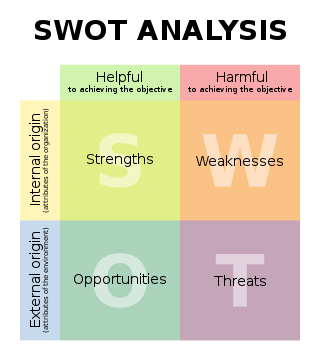

# Review of TeamDecades Candidate Pitch - 2018

## Table of Contents

- [TeamDecades Web Site Tour](#teamdecades-web-site-tour)
- [2018 Web Site Review](#2018-web-site-review)
---

## TeamDecades Web Site Tour

- [Current Web Site](https://www.teamdecades.com/)

1. Home:  
Welcomes candidates and presents Career Search Representation and Consultation intro.  
Speaks to high-value clients.  
"We believe that the depth and strength of our relationships is critical to our success and to our clients' satisfaction."
Multi-location footprint in footer.  
No specific industries indicated.  

2. About Us:  Our team intro, etc.  Why you need us.

3. Process:  Published (Pros/Cons) vs Unpublished Job Markets.

4. Our Team:  More about our team.  Researchers.  Selection Committee.  Marketing Team.  Writers.

5. Testimonials:  Half-dozen+ paragraphs of success stories.   NEXT PAGE LINK BROKEN!

6. Contact Us:  Standard form.

7. FAQ:  
- What is the difference between working with Decades and working with a recruiter?
- How does Decades differ from its competitors?
- What industries do you specialize in?
- Can Decades effectively assist me if I’m unwilling (or unable) to relocate?
- Will Decades accept every candidate that’s willing to pay the fee?
- What is your success rate?
- Why hire Decades?
- https://www.efinancing-solutions.com/solutions/app.asp?oid=3555

8. Clients:  Qualified candidates.  Candidate exclusion..

## 2018 Web Site Review

- Responsive Web Design:  None

- Strategic SEO Findings: Pending **

- One-Size-Fits-All Approach

- All Docs Provided As Attachments.  MS Office formats.

- No Online Education Options

- No References TO Current and Emerging Technical Trends.

- No Clear Path for Consultant to Become Salaried Employee.

- No Candidate Team-Up Options

## Standard Recruiter Missteps

- 

## Standard Technical Recruiter Missteps

- 

---

## Framework For Further Proposals Which Can Be Requested

1. Web Site Information Design & Format Enhancements

2. Web Site Information Architecture Enhancements 

3. High-Value Online Learning Options

4. Workflow Analysis Targets:

* [Request For Proposal Workflows](https://www.newmediacampaigns.com/blog/website-design-request-for-proposal-template-tips)
* Engaging Candidate Attention and Curiosity Workflows
* Candidate Commitment Solicitation Workflows
* Candidate Recruiting Workflows
* Client Review & Hiring Workflows
* Course Training Workflows

5. Feasibility Analysis For Any New Initiative

- [SWOT Analysis](https://en.wikipedia.org/wiki/SWOT_analysis)

6. Proofs Of Concept Proposals

7. [Project Planning & Implementation Tools](https://www.atlassian.com/software/jira)

---

## Enhancements

---

## Task Checklist

---